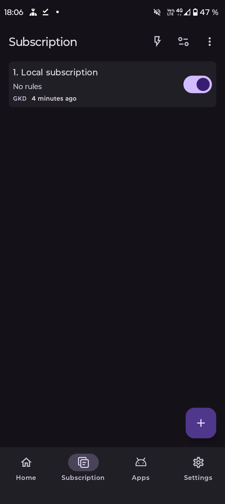
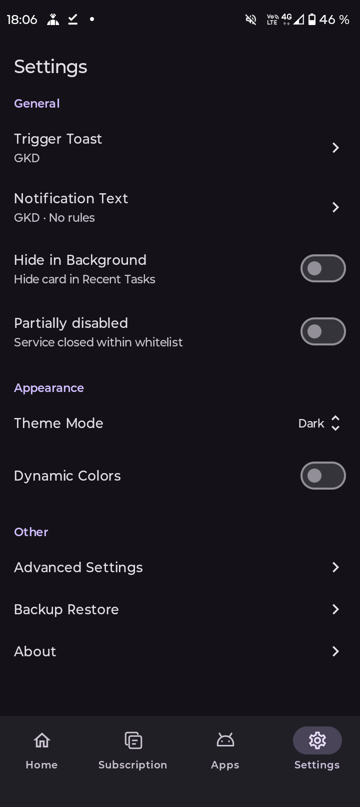
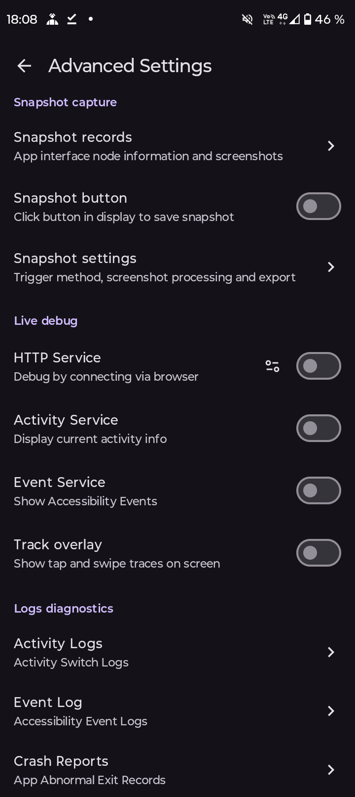
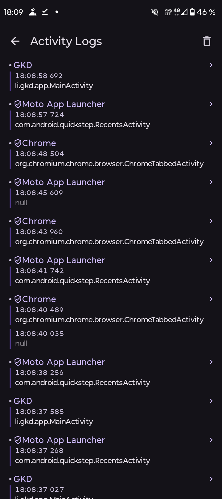
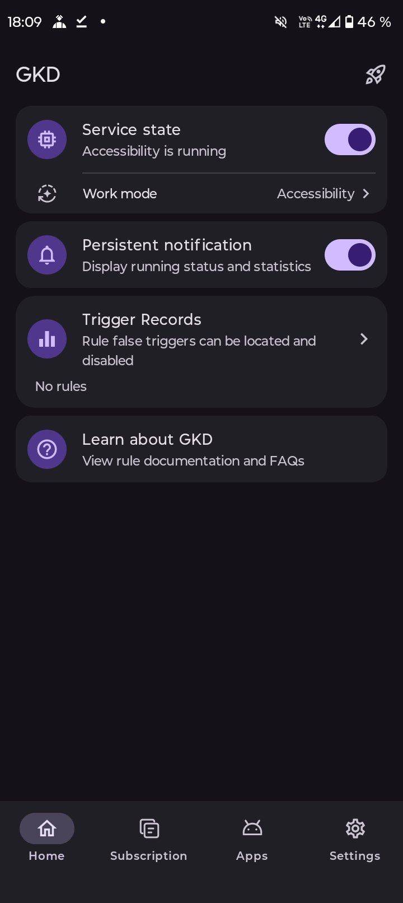
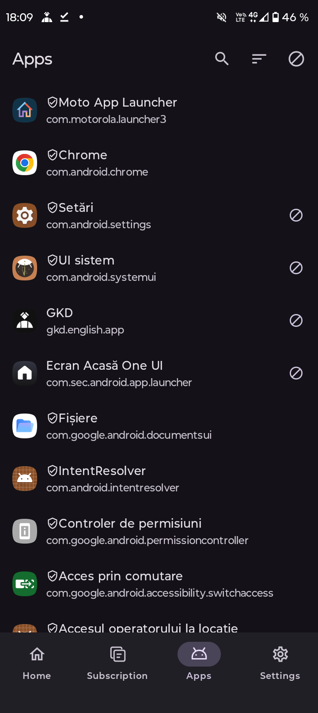

# gkd-english

Custom screen-tap Android app based on [advanced selectors](https://gkd.li/guide/selector) + [subscription rules](https://gkd.li/guide/subscription) + [snapshot inspection](https://github.com/gkd-kit/inspect)

Through custom rules, on specified interfaces, when specified conditions are met (such as specific text existing on screen), tap specific nodes or positions or perform other actions

- **Quick actions**

  Helps you simplify some repetitive processes, such as certain software automatically confirming computer login

- **Skip flows**

  Some software may have annoying flows during startup. This app can help you tap to skip the flow

## Disclaimer

**This project is open source under [GPL-3.0-only](/LICENSE) and is for learning and exchange only. Commercial or illegal use is prohibited.**

## Install

If you encounter issues, please first check the [FAQ](https://gkd.li/guide/faq)

## Screenshots

|                                                               |                                                               |                                                               |
| ------------------------------------------------------------- | ------------------------------------------------------------- | ------------------------------------------------------------- |
|                                           |                                           |                                           |
|                                           |                                           |                                           |

## Subscription

GKD **does not provide rules by default**. You need to add local rules yourself, or obtain remote rules through subscription links

You can also quickly build your own remote subscription through [subscription-template](https://github.com/gkd-kit/subscription-template)

Third-party subscription lists can be viewed at <https://github.com/topics/gkd-subscription>

To join this list, click the settings icon in the top right corner of the repository homepage and add `gkd-subscription` in Topics

Example image - Add to Topics (click to expand)

## Selector

A selector similar to a CSS selector, which can relate to node context information, making it easier and more precise to find the target node

<https://gkd.li/guide/selector>

[@[vid="menu"] < [vid="menu_container"] - [vid="dot_text_layout"] > [text^="ad"]](https://i.gkd.li/i/14881985?gkd=QFt2aWQ9Im1lbnUiXSA8IFt2aWQ9Im1lbnVfY29udGFpbmVyIl0gLSBbdmlkPSJkb3RfdGV4dF9sYXlvdXQiXSA-IFt0ZXh0Xj0i5bm_5ZGKIl0)

Example image - Selector path view (click to expand)

## Derivatives

Derivative projects during development that are being used by gkd, which may be helpful to you

- [kotlin-json5](https://github.com/lisonge/kotlin-json5)
- [kotlin-codeorigin](https://github.com/lisonge/kotlin-codeorigin)
- [android-api-diff](https://github.com/android-cs/android-api-diff)
- [remap](https://github.com/lisonge/remap)
- [priv-kit](https://github.com/priv-kit/priv-kit)

## Donate

If GKD is useful to you, you can support the project through the following links

<https://github.com/lisonge/sponsor>

Or go to [Google Play](https://play.google.com/store/apps/details?id=li.songe.gkd) and leave a good review
